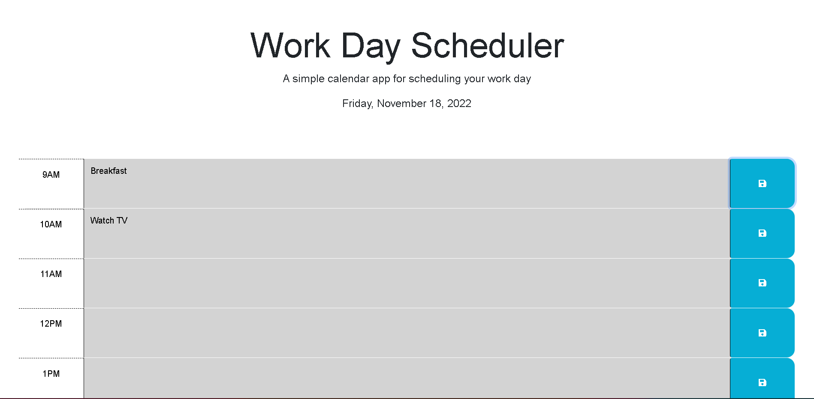

# Calendar: Daily Scheduler

## Description

In this project I created a web application that can record hourly inputs from the user.  The app can save the input for the user to reference later.  The application is responsive to the current time, displaying the text blocks in a different color.

## Usage

The website is hosted at this link: https://smudge121.github.io/Calendar-Scheduler/ 

To use the application, visit the link above.  Type in your scheduled events for the day and press save.  You can revisit the site to view your schedule as well as make changes and updates.  To view the source files, download the project from github. The javascript and css are stored in the develop folder.

## Credits

1. Developed by Jaret Ishii
2. HTML and CSS provided by UCI Coding bootcamp.

## License

MIT License